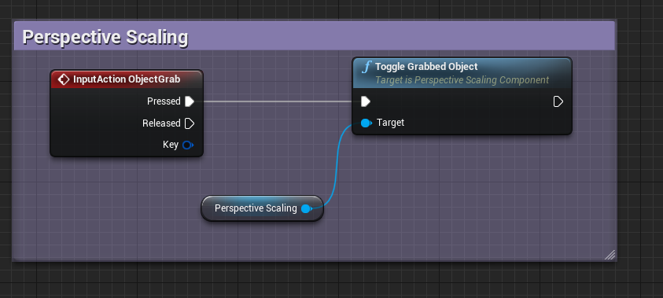

# Perspective Scaling
Grab and move objects around the world while maintaining the same viewport size. 

This is a project containing the plugin 'Perspective Scaling' and a project that displays the plugin in action.

## How to set up
- Copy the folder `Plugins/PerspectiveScaling` to the `Plugins` folder in the project root directory that will use this plugin. 
- Then in the UE4 editor: Edit->Plugins->Project->Perspective Scaling. Enable the plugin. 
- Add a `Perspective Scaling Component` to an actor. This actor should be similar to the FirstPerson example project. This will provide the actor with the ability to pick up objects and move/scale them.
- Create an action, called e.g. `ObjectGrab`. Within the actor that has the `Perspective Scaling Component` bind this action to the component function `Toggle Grabbed Object`. See image below.
- Add a trace channel to the project called `PerspectiveScale`. Set any object to block this if it can be picked up and scaled.

## Try it out
The provided .uproject file shows off the plugin in a ready-to-use map.

## Issues
Only tested for engine version 4.21. 
Will only pick up and scale `StaticMeshActors`.

Inspired by the reddit post by BojanV03 https://www.reddit.com/r/unrealengine/comments/glfx9j/small_breakdown_i_made_of_how_forced_perspective/. Using Actor bounds rather than mesh vertices for performance improvement.
